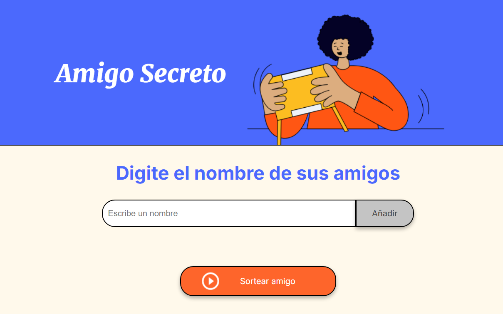

# 🎁 Amigo Secreto - Sorteo de Nombres

Bienvenido al proyecto **Amigo Secreto**, una aplicación web sencilla e interactiva para realizar sorteos de "amigo secreto" entre un grupo de personas. Este proyecto fue desarrollado como parte del proceso de aprendizaje en el PROGRAMA **ONE (Oracle Next Education) en colaboración con Alura Latam**.

## 🚀 Descripción del Proyecto

Esta aplicación permite agregar nombres a una lista y realizar un sorteo aleatorio para seleccionar un "amigo secreto". Es ideal para reuniones, eventos o simplemente para divertirse con amigos y familiares.

### ✨ Funcionalidades

- Agregar nombres a la lista.
- Mostrar la lista de participantes.
- Seleccionar aleatoriamente un nombre como "amigo secreto".
- Mensajes de alerta si la lista está vacía o si el nombre ingresado no es válido.

## 🛠️ Tecnologías Utilizadas

Este proyecto fue construido con:

- **HTML5** - Estructura del proyecto.
- **CSS3** - Estilización y diseño responsivo.
- **JavaScript (Vanilla)** - Lógica de la aplicación.

## 🎮 Cómo Usarlo

1. **Ingresa nombres** en el campo de texto y presiona el botón "Añadir".
2. Los nombres se agregarán a la lista.
3. Una vez agregados los nombres, presiona el botón **"Sortear amigo"**.
4. Se seleccionará aleatoriamente un nombre y se mostrará en pantalla.

## 📸 Lo veras de esta manera



## 📂 Estructura del Proyecto

```plaintext
📂 amigo-secreto/
├── 📄 index.html  # Estructura principal del sitio
├── 📄 style.css   # Estilos y diseño visual
├── 📄 app.js      # Lógica del sorteo
├── 📂 assets/     # Imágenes e íconos utilizados
└── 📄 README.md   # Documentación del proyecto
```

## 📌 Instalación y Uso

1. **Clonar el repositorio**

```bash
   git clone https://github.com/Alexander-Salvador/challenge-amigoSecreto.git
```

1. **Abrir el archivo `index.html`** en el navegador.

## 💡 Mejoras Futuras

- ✅ Agregar opción para eliminar nombres de la lista.
- ✅ Implementar un historial de sorteos.
- ✅ Crear una animación para el sorteo.
- ✅ Hacerlo compatible con dispositivos móviles.

## 🤝 Contribuciones

¡Toda contribución es bienvenida! Si deseas mejorar el proyecto, no dudes en hacer un **fork** y enviar un **pull request**. También puedes reportar problemas en la sección de **issues**.

## 📜 Licencia

Este proyecto está bajo la licencia **MIT**. Puedes usarlo y modificarlo libremente.

---

📌 _Desarrollado con 💙 para el Programa ONE (Oracle Next Education) en colaboración con Alura Latam._
